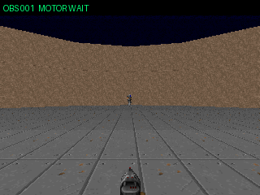
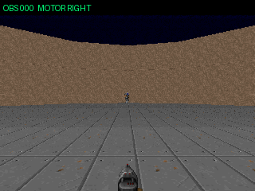

# Thought Leak Range

> **VizDoomをCloud LLMにやらせた。ゲームを止めず、一文字で探索・旋回・発砲まで全部選ばせる。**

Cloud LLMの判断を、35 Hzで動き続けるoffline ViZDoomへ非同期で接続する実験です。
V4 `direct-motor`ではLlama 3.1 8Bが毎回`0`〜`5`のmotor tokenを一つ返し、
その一文字が固定長のWAIT / LEFT / RIGHT / FIREへ直結します。local側は敵を見て
操作を選び直さず、応答の年齢・順序・文法だけを検査します。

```text
ViZDoom labels (v/x/ammo) ── 0.1秒ごと ──> Llama 3.1 8B / Groq
          worldは35 Hzで止まらない             3 requestを時間差で重ねる
                                                     │
                                                     ▼
                    "0" WAIT / "1,2" LEFT / "3,4" RIGHT / "5" FIRE
                                                     │
                                                     ▼
                      400 ms鮮度・単調な観測番号・固定1/2/5 tickだけ検査
                                                     │
                                                     └─ ViZDoomへ直接入力
```

paired seed 7〜16を15秒ずつ走らせ、V4は公式KILLCOUNT 35、HITCOUNT 34でした。
1 killは弾薬もHITCOUNTも増えずKILLCOUNTだけ増えたため、Doomのmonster infightingと
思われる別枠です。

| 指標 | V2: local追尾＋LLM発砲 | V3: 4 Cloud Agent | V4: 一文字運動野 |
|---|---:|---:|---:|
| 10 run平均kill | 5.4 | 1.5 | **3.5** |
| run平均判断latency | 253.0 ms | 282.1 ms | **252.2 ms** |
| WAIT tick比率 | 35.2% | 60.2% | **27.3%** |
| 実弾あたりhit | 87.1% | 53.6% | 45.3% |
| local操作判断 | 左右追尾あり | なし | **なし** |

V4の観測からtoken到着までは中央値250 ms、FIRE tick実行までは中央値281 msです。
V3には10 / 10 seedで勝ち、V2には0勝9敗1分でした。V2は35 Hzのlocal追尾を持つため、
V4の主な達成は勝敗よりも「誤判断を含む全操作をCloud LLM自身へ戻した」ことです。

以下はV4 seed 12の全編replayです。字幕の`MOTORLEFT / MOTORRIGHT / MOTORFIRE`が
Cloud LLMの一文字から実行された操作で、このrunは5 hit / 5 KILLCOUNTでした。



V2の5発5 hit replayも比較用に残しています。



出発点だった「streamed raw reasoningを盗み見し、final answerもtool callも待たずに
身体へ漏電させる」modeも残っています。`fire-gate`はLLMのraw thinkingを短命な
射撃許可へ変換し、`direct-bit`はthinkingを捨てて本当に一発ずつLLMへ選ばせるbaselineです。

これはオンラインゲームbotではありません。OSのキーボードやマウスには触れず、
同梱のViZDoom練習scenarioだけをAPI経由で操作します。

## 実験の境界

- 敵知覚はraw pixelsでなくViZDoom labelsの構造化位置
- `direct-aim-assist`は左右へ追尾するが、FIREを返せない
- 一発ごとのFIRE / WAITだけはcloud LLMが決め、local側は誤判断を都合よく取消さない
- 推論中もworldは35 Hzで進み、古い判断はlatest-observation / 300 ms guardで捨てる
- raw thought版と一文字classifier版の結果を混ぜない
- `four-agent`ではlocal左右追尾も外し、4本のCloud streamだけが全操作を選ぶ
- `direct-motor`では一つのLLM policyが方向とpulse長を一文字で選び、local側は固定変換だけ行う
- commercial game、native input、anti-cheatへ接続しない

## セットアップ

Python 3.12と[uv](https://docs.astral.sh/uv/)を使います。

```powershell
cd prototypes/thought-leak-range
uv sync --extra dev --python 3.12
```

まず課金も通信もない模擬思考で、射撃室と安全装置を確認します。

```powershell
uv run python -m thought_leak_range mock --duration 6
```

OpenRouter版は環境変数を使います。秘密値は引数やrepositoryへ書かないでください。

```powershell
$env:OPENROUTER_API_KEY = Read-Host "OpenRouter API key"
uv run python -m thought_leak_range live `
  --tap-mode thought-phrase `
  --duration 20 `
  --max-requests 8 `
  --max-usd 0.005 `
  --save-thoughts
Remove-Item Env:OPENROUTER_API_KEY
```

既存の`.env`を明示してprocess内だけで読むこともできます。

```powershell
uv run python -m thought_leak_range live `
  --env-file C:\path\outside\repo\.env `
  --tap-mode thought-phrase
```

既定modelはOpenRouter上の正式slug `deepseek/deepseek-v4-flash-0731`、reasoning effortは
このmodelが対応する最小値の`low`です。起動時probeがraw reasoningと有効markerを
確認できなければ、ゲームへ操作権を渡さず停止します。

OpenRouterのproviderは`data_collection=deny`を保ったまま、FPS実験なので
最初のtokenを優先する`sort=latency`を指定します。特定providerを比較する時は
`--provider Groq --no-provider-fallback`のようにfallbackも止めます。

## 操作モード

| mode | 拾うもの | 扱い |
|---|---|---|
| `marker` | `[[ACT run=...]]` | 既定。nonce付きでfail closed |
| `thought-phrase` | `So action is RIGHT.` | V0。元の発想そのものだが、offline限定 |
| `fire-gate` | `So trigger is ARMED/SAFE.` | LLMは引き金だけ。探索・追従は35 Hzのlocal spine |
| `direct-shot` | raw reasoningのrequest-bound bit | 一判断を一回のFIRE tickへ直結、nonceあり |
| `direct-bit` | visible出力の最初の厳密な`1 / 0` | nonceなし。一文字のstreaming classifier baseline |
| `four-agent` | 4専門streamの最初の厳密な`1 / 0` | V3。WAIT / LEFT / RIGHT / FIREが一つの身体を共有 |
| `direct-motor` | visible出力の最初の厳密な`0`〜`5` | V4。一つのpolicyが全操作と1/2/5 tick pulseを直接選択 |

DeepSeek V4 Flashは最初の実測で、action markerをraw reasoningではなくvisible回答へ
書きました。そのため安全な`marker` modeは正しく停止しました。
`thought-phrase`はraw reasoning中の狭い決定句を拾う実験用迂回路です。
引用や仮定を完全には判定できないため、オンラインゲームやnative inputには使えません。

動く敵には`fire-gate`を使います。LLMの`ARMED`は発砲そのものではなく3秒の
射撃許可です。local spineが敵を探し、左右へ追従し、敵が中央にいて弾があるtickだけ
発砲します。`SAFE`、期限切れ、敵不在なら即座に撃たなくなります。

```powershell
uv run python -m thought_leak_range live `
  --model deepseek/deepseek-v4-flash-0731 `
  --tap-mode fire-gate `
  --scenario defend_the_center `
  --duration 15 `
  --observation-interval 1.0 `
  --max-requests 10 `
  --max-usd 0.005 `
  --save-thoughts
```

## 2026-08-18の実射

### 固定標的: thinkingを直接WASDへ

最終runではprobeを含む8 requestで、raw reasoningから
`RIGHT`を4回、`FIRE`を1回受理しました。

- 観測からcommit句まで平均1.647秒
- 700 tick中、`RIGHT` 57 tick、`FIRE` 13 tick、dead-man `WAIT` 630 tick
- Cacodemonの画面位置は`+0.450`から`-0.091`へ移動
- 弾薬は`50`から`49`になり、本当に一発出た
- OpenRouter実費は`$0.00045318`

詳しくは[実験記録](docs/experiment.md#raw-reasoning版)へ。

### 動く敵: LLMは引き金だけ

正確な`deepseek/deepseek-v4-flash-0731`と`defend_the_center`で15秒実走し、
左右から来るDemonを4体倒しました。

- probe込み10 request、API error 0
- 有効な`ARMED / SAFE` 6件、平均`1.068秒`、最速`625 ms`
- local spineは探索315 tick、射撃25 tick、射撃許可中169 tick
- ammo `52 → 47`、kill `0 → 4`
- 古い`ARMED`が2件遅着したが、観測世代guardでどちらも棄却
- OpenRouter報告実費`$0.0010724`、上限`$0.005`

`obs=7`の一度の3秒`ARMED` lease中に、脊髄が照準を合わせ続けて2体倒しました。
これは「LLMが一発ずつクリックする」より、遅い判断と速い身体を分業したほうが
FPSらしく動くという最初の実証です。

詳しくは[実験記録](docs/experiment.md#fire-gate版)へ。

### 一発ずつ直接: nonceなしdirect-bit

`Llama 3.1 8B Instruct + Groq`でreasoning、nonce、templateを捨て、visibleの最初の
非空白文字が`1`の時だけ次の一回のFIRE tickへ直結した。

- startup probeは219 ms
- game中16判断を受理、最速204 ms、中央値265 ms、平均255.9 ms
- FIRE / WAITは9 / 7、意味的に16 / 16正解
- 6 FIRE tick、ammo `52 → 47`、5 hit、65 damage、5 kill
- local controllerは左右追尾だけで、中央確認による発砲取消しや再試行なし
- 実費 `$0.00012228`

```powershell
uv run python -m thought_leak_range live `
  --env-file C:\path\outside\repo\.env `
  --model meta-llama/llama-3.1-8b-instruct `
  --provider Groq --no-provider-fallback `
  --tap-mode direct-bit --direct-aim-assist `
  --scenario defend_the_center `
  --duration 15 `
  --direct-max-age-ms 300 `
  --max-tokens 16 --max-requests 40 `
  --max-usd 0.005 --save-thoughts
```

詳しくは[一発ずつ撃つ実験記録](docs/experiment.md#direct-bit版)へ。

### V3: 四人制運動野

`WAIT / LEFT / RIGHT / FIRE`ごとに独立したCloud LLM requestを同時起動し、各Agentは
`1=自分の出番 / 0=違う`だけを返す。前ラウンドの4票と実行動作は圧縮黒板として
次ラウンド全員へ渡す。優先度は`FIRE >>> WAIT = LEFT = RIGHT`で、local側は敵位置から
動作を選ばない。

8 laneで二世代を重ねた15秒challengeでは、4 Agentだけで探索・左右旋回・発砲し、
3体を倒した。

- 522 tick（約14.9秒）、終了時health 0
- 172 game request、166完了、provider 429が2件
- 166票中156票が意味的に正解（94.0%）
- 選択latency 最速234 ms / 中央値265 ms / 平均273.1 ms
- 4 FIRE tick、ammo `52 → 49`、3 hit、35 damage、3 kill
- OpenRouter報告実費はstartup probe込み`$0.00085615`

```powershell
uv run python -m thought_leak_range live `
  --env-file C:\path\outside\repo\.env `
  --model meta-llama/llama-3.1-8b-instruct `
  --provider Groq --no-provider-fallback `
  --tap-mode four-agent --lanes 8 `
  --scenario defend_the_center --duration 15 `
  --observation-interval 0.30 `
  --council-movement-ttl-ms 600 `
  --council-fire-max-age-ms 400 `
  --max-tokens 16 --max-requests 380 `
  --max-usd 0.03 --save-thoughts
```

設計は[四人制運動野](docs/v3-four-agent-blackboard.md)、全runと失敗は
[V3実験記録](docs/experiment-v3.md)へ。黒板を補助判断に使わせた途端にFIREとLEFTが
全員黙ったため、baselineでは黒板を注入・記録しつつ判断には使わせない。この失敗も
[黒板干渉記録](docs/v3-blackboard-interference.md)へ残した。

V2 / V3をpaired seedで各10回実行すると、平均killは`5.4 vs 1.5`でV2が10 / 10勝利した。
V3は全操作Cloud化を達成した一方、WAIT tickが60.2%、古い世代の棄却が464票に達した。
詳細は[各10回比較](docs/experiment-v2-v3-10x.md)へ。

### V4: 一文字運動野

V3の4人会議を解散し、一つのCloud LLM policyへ6種類のmotor tokenを直接選ばせます。
3 laneは別人格ではなく、同じpolicyを時間差で重ねる非同期pipelineです。

| token | 意味 | 固定pulse |
|---:|---|---:|
| `0` | WAIT | 1 tick |
| `1` / `2` | LEFT_SHORT / LEFT_LONG | 2 / 5 tick |
| `3` / `4` | RIGHT_SHORT / RIGHT_LONG | 2 / 5 tick |
| `5` | FIRE | 1 tick |

local側は`v/x/ammo`を作り、一文字をallow-listで読み、400 ms以内かつ観測番号が
単調増加なら表どおり実行するだけです。FIRE直前の中央再確認、左右の補正、cooldown中の
自動再試行はしません。LLMの誤答65件も採用され、そのまま身体へ入りました。

```powershell
uv run python -m thought_leak_range live `
  --env-file C:\path\outside\repo\.env `
  --model meta-llama/llama-3.1-8b-instruct `
  --provider Groq --no-provider-fallback `
  --tap-mode direct-motor --lanes 3 `
  --scenario defend_the_center --duration 15 `
  --observation-interval 0.10 `
  --motor-token-max-age-ms 400 `
  --max-tokens 16 --max-requests 180 `
  --max-usd 0.025
```

`--motor-body`の既定値は`legacy`だが、world clockが`ASYNC_PLAYER`なのでC相当であり、formal Bではない。
formal Bは親`6874fa3`の`Mode.PLAYER`固定runnerへ敵認識だけを当てた、
commit `93e157f`（branch `agent/legacy-v4-enemy-fix`、worktree
`prototypes/thought-leak-range-legacy-v4`）で取る。
`--motor-body tick-lease`は、同じgame tick内の完了を一件へまとめ、pulseをViZDoom tickで
期限管理するASYNC診断条件である。ASYNC_PLAYERのnative actionが期限を越えて保持されたrunは、
summaryの`comparison_valid=false`として性能平均へ入れない。
正式Dは`--world-clock clock-thread --motor-body clock-thread`で起動する。ViZDoomを専用の
`Mode.PLAYER` clock threadだけが所有し、Cloud asyncioはdecision mailboxへ結果を渡す。
そのためCloud待ち中もworldは1 native tickずつ進み、FIREの保持期限がPython loopへ依存しない。
formal Dの比較runは追加のGIF用`frame()`読み出しを行わず、summaryで
`initialization_ms`、`active_wall_ms`、`simulation_duration_ms`、`effective_tick_hz`を分離する。
初期化時間やnative clockの低下で条件を満たさないrunは`comparison_valid=false`になる。

ゲームへ入る前に6 tokenを一度ずつ問い合わせ、一つでも違えばfail closedします。
最初の条件文だけのpromptは6問中3問を誤り停止しました。few-shot例へ直した後は、
10 runすべての起動試験が6 / 6で通過しています。

- 10 run合計: 35 KILLCOUNT、34 hit、75実弾、平均3.5 kill
- 判断: 1,051件中984件正解（93.6%）、1,020件受理、31件期限・順序で棄却
- latency: 受理token中央値250 ms、p95 313 ms、観測からFIRE tick中央値281 ms
- 操作: WAIT 27.3%、game request 1,072、API error 0
- OpenRouter報告実費: 10 runで`$0.01106659`

設計境界は[一文字運動野](docs/v4-direct-motor.md)、全seed・集計・ボトルネックは
[V4各10回実験](docs/experiment-v4-10x.md)、promptの面白い転び方は
[六択を一行で教えたら三問落とした](docs/v4-probe-language-failure.md)へ残しています。

### V5実験: 意味4文字 + HOLD5

V4の核である「各Cloud responseが単体で実行できる完全命令」と3 laneを残し、
wire tokenを意味のある`W / L / R / F`へ削りました。`L/R`は最大5 native tickだけ保持し、
別laneから新しい完全命令が届けば次のnative tickで即preemptします。`F`は常に1 tickだけです。

```powershell
uv run python -m thought_leak_range live `
  --env-file C:\path\outside\repo\.env `
  --model meta-llama/llama-3.1-8b-instruct `
  --provider Groq --no-provider-fallback `
  --tap-mode direct-motor-lite --lanes 3 `
  --scenario defend_the_center --duration 15 `
  --observation-interval 0.10 `
  --motor-token-max-age-ms 400 `
  --world-clock clock-thread --motor-body clock-thread `
  --max-tokens 16 --max-requests 180 --max-usd 0.025
```

Formal Dのseed 7〜9は`2 / 1 / 2 kill`。方向保持、preempt、1 tick FIRE、35 Hz、
期限違反0はすべて成立しましたが、V4の`2 / 4 / 4 kill`には負けました。
4択化で意味精度は上がった一方、短い微調整まで5 tickになって実弾18発中5 hitへ低下しました。
つまりV4のpulse長は単なるCloud待ち対策ではなく、照準の一部でもありました。
詳細は[転換点の再読](../../docs/実験/2026-08-21-V3-V4転換点の再読.md)へ。

### V4-S: 停止世界へ同じV4を移植

`--world-clock vago-sync`を付けると、観測後にViZDoomを止め、最初の有効な一文字が
届いた時だけ固定pulseぶん進めます。worldが止まっている間は新しい観測も生まれないため、
指定した3 laneは実効1 laneになります。完成文ではなく最初のstreamed digitで動くこと、
6択prompt、400 ms TTL、誤答を補正しない規則は通常V4と同じです。

現行code・同じmodel・seed 12を数分差で走らせたclock ablationは次の結果でした。

| 指標 | 通常V4: 35 Hz継続 | V4-S: VAGO式停止 |
|---|---:|---:|
| KILLCOUNT / HITCOUNT | 2 / 2 | **6 / 6** |
| 生存したgame時間 | 11.600秒 | **13.886秒** |
| wall time | 11.609秒 | 47.015秒 |
| Cloud待機中のgame tick | 進む | **158 / 158回すべて0** |
| WAIT tick | 106 | **3** |
| pulse preemption | 38 | **0** |


停止版は64回FIREを選んだのに、弾薬は7発しか減りませんでした。Cloudを待つ200 msは
銃のcooldownを1 tickも進めないため、思考時間だけ無料で身体時間は無料にならないからです。
これは同じV4のworld clockだけを替えた一seed実験であり、VAGOのASCII＋depth入力や
1.3M専用modelとの直接対決ではありません。全条件とraw artifactは
[V4-S実験記録](docs/experiment-v4-vago-sync.md)へ。

#### 時計修正版の10 paired run

前の通常版はPythonのevent loopから`Mode.PLAYER`を手動tickしていたため、長いnative/provider
stallで「動く世界」そのものが止まる可能性があった。現在の通常版はViZDoom `ASYNC_PLAYER`へ
切り替え、停止版だけが`PLAYER`を使う条件でseed 7〜16を再取得した。

| 指標 | 通常 `ASYNC_PLAYER` | 停止 `PLAYER` |
|---|---:|---:|
| 10 run kill | 25 | **64** |
| 平均 kill | 2.5 | **6.4** |
| paired勝利 | 0 | **10 / 10** |
| 平均kill差（停止−通常） | — | **+3.9** |
| preemption | 642 | **0** |
| API error | 0 | 0 |
| 総費用 | — | **$0.02512097** |

これはLLMの理解力比較ではなく、同じV4へ異なるworld clockを接続したablationである。
全指標と限界は[時計修正版10回比較](docs/experiment-v4-clock-async-10x.md)へ残した。

```powershell
uv run python -m thought_leak_range live `
  --env-file C:\path\outside\repo\.env `
  --model meta-llama/llama-3.1-8b-instruct `
  --provider Groq --no-provider-fallback `
  --tap-mode direct-motor --world-clock vago-sync --lanes 3 `
  --scenario defend_the_center --duration 15 --seed 12 `
  --motor-token-max-age-ms 400 `
  --max-tokens 16 --max-requests 200 --max-usd 0.025
```

VAGO benchmark同様に各pulse tickを4 native tic保持する破壊的ablationは、
`--vago-frame-skip 4`で明示的に有効化します。V4のLONGは20 ticになるため、通常実験の
既定値は1のままです。

## 先行例との差

cloud LLMをViZDoomへ接続した先行例はあります。2026年の
[SauerkrautLM-Doom-MultiVec](https://github.com/VAGOsolutions/SauerkrautLM-Doom-MultiVec)
は、ASCII＋depthからcloud LLMへ4 actionを選ばせています。ただし公開benchmarkは
API completionを同期的に待ってから`make_action()`するため、推論中にworldが進みません。
これはcode読解だけでなく、0 ms / 650 msで全18画面・depth・killが完全一致する
[公式runner実測](docs/vago-sync-probe.md)でも確認しました。

Thought Leak Rangeは世界初を主張しません。現在の差は、**worldを止めず、非同期cloud判断の
古さを管理し、間に合った一文字だけを一発へする**ことです。比較の詳細は
[先行技術メモ](docs/prior-art.md)へ。

## Roadmap

- V4の196-token教科書を、6 / 6 probeを壊さず短縮・cache・fine-tuneする
- 古い座標へ固定pulseを出す代わりに、LLM自身へ速度・予測時刻つきtokenを選ばせる
- labels版とraw pixels / ASCII / depth版を同じunpaused条件で比較する
- `unpaused` / `vago-sync`を10 paired seedへ広げ、clock効果とrun分散を分離する
- V3の黒板は別branchの四人会議として、精度を壊さない協調表現へ育てる
- score上のkillと、弾で確認できたhit-confirmed killを常に分ける

## 生成物

各runは`runs/<timestamp>/`へ次を残します。

- `events.jsonl`: 観測、marker受信、採用/拒否、action、API metadata
- `summary.json`: latency、request数、token、費用、kill/reward
- `episode.gif`: headlessでも見返せる低fps replay
- `thoughts.jsonl`: `--save-thoughts`を付けた時だけのraw reasoning断片

API keyはどのfileにも保存しません。HTTP errorへkeyが混ざった場合もredactします。

## 安全境界

- markerの文法は `[[ACT run=... obs=... ttl=... action=...]]` のみ
- `direct-bit`はresponseごとにparserを分離し、最初の非空白`1 / 0`以外はfail closed
- `four-agent`もresponseごとに観測番号と担当動作を固定し、古い世代は実行しない
- `direct-motor`は最初の非空白`0`〜`5`だけを読み、最大5 tick・400 msで必ず失効
- `--motor-body tick-lease`では`obs_game_tick`のない結果を実行せず、1 game tickにつきcommitは最大1件
- formal Dの`clock-thread`では`DoomGame`をgame threadだけが触り、`make_action(..., 1)`を1 native tickずつ実行
- actionは`WAIT / LEFT / RIGHT / FIRE`のallow-list
- nonce、観測番号、TTL、重複、最大request数、費用見積りを検査
- `ARMED`だけでは撃たず、最新tickで敵が中央・弾薬ありの時だけlocal spineが発砲
- raw text中の日本語や`FIRE`という単語は実行しない
- leaseが切れたtickは必ず全ボタンを離す
- model出力をshell、Python、任意codeとして実行しない
- commercial game、anti-cheat、native inputへ接続しない

## Test

```powershell
uv run python -m pytest
```
