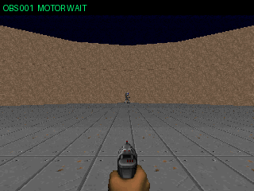
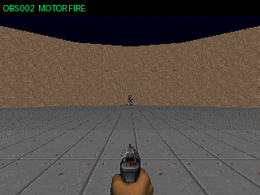

# V4 Async × flat-4 — visual-only 10 episode

これは非同期Flat-4の肉眼確認用GIFであり、正式benchmarkではない。
録画用screen readと3 process並列実行がViZDoom時計へ影響するため、kill・秒・Hzは
`docs/experiment-v4-async-flat-4.md`の正式値に混ぜない。

## seed 07〜11

## seed 12〜16

