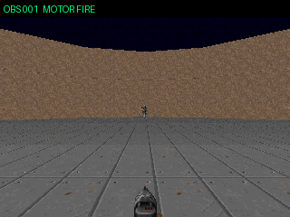

# V4-S × VAGO frame skip 4 — 60秒設定・10 episode

V4のFIRE=1、SHORT=2、LONG=5 pulseへ、VAGO benchmark型のframe skip 4を機械的に掛けた。
結果はFIRE=4、SHORT=8、LONG=20 native tic。seed 7〜16を3 process並列で実行した。

## 結果

- 31 kill / 31 hit、平均3.10 kill
- 60秒生存0/10
- 全員9.4〜14.8秒で死亡
- request error 0
- FIRE 92判断から33発、発弾率35.9%
- native timeの約91%が左右旋回

frame skipは銃のcooldown starvationを改善した。しかしLONG 20 ticが照準を破壊し、
frame skip 1 controlで全員が生きていた15秒へ一人も到達できなかった。

## GIF

### seed 07〜11

### seed 12〜16

