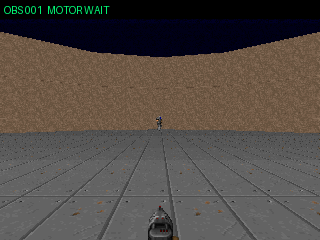

# V4失敗replay — 敵が二体になったら標的が左右へ瞬間移動した

これはV4一文字運動野の実Cloud runで、敵が増えたあと左右旋回を繰り返し、
0 killのまま倒された失敗例である。



## Run

- mode: `live / direct-motor`
- model: `meta-llama/llama-3.1-8b-instruct`
- provider: Groq via OpenRouter
- seed: 12
- 平均判断遅延: 283.7 ms
- 判断精度: 52 / 53
- 結果: 0 hit / 0 kill / health 0

LLMの分類精度は悪くない。それでも一発しか撃てず、当たらなかった。

## 見つかった標的スイッチ

観測器は複数の敵をLLMへ列挙していない。monster候補のうち画面上の面積が最大の
一体だけを選び、`v / x / a`を一組送っている。ところが二体の見かけの大きさが
入れ替わると、選ばれる`target_id`も入れ替わる。

```text
obs31: target_id=3  x=-0.800
obs32: target_id=6  x=+0.716
obs33: target_id=3  x=-0.750
```

3 laneには、それぞれ異なる時点の「完全な命令」が残る。この切り替わりでは
LEFTとRIGHTがCloud遅延を挟んで交互に到着し、V4の強いLONG pulseが逆に往復運動を
増幅する。敵が一体のときに強かったsample-and-holdが、標的identityが不安定になると
「さっき選ばれた別の敵を長く追う」装置になる。

## 次の最小修正候補

入力をさらに減らす必要はない。すでに一体だけである。必要なのは、近い敵を一度選んだら
数観測だけidentityを固定するtarget lock / hysteresisである。

- 現在のtargetが見えている間は、少し大きい別敵へ即座に乗り換えない
- 別敵が十分に大きい、または現在targetが消えた場合だけ切り替える
- Cloudには従来どおり一体分の`v / x / a`だけを送る
- localが照準方向を決めるのではなく、**どの敵について尋ねるか**だけを安定させる

これはlocal aim assistではない。LLMがLEFT / RIGHT / FIREを決める境界は変えず、
同時に三人の敵を指さす壊れた観測だけを防ぐ。
